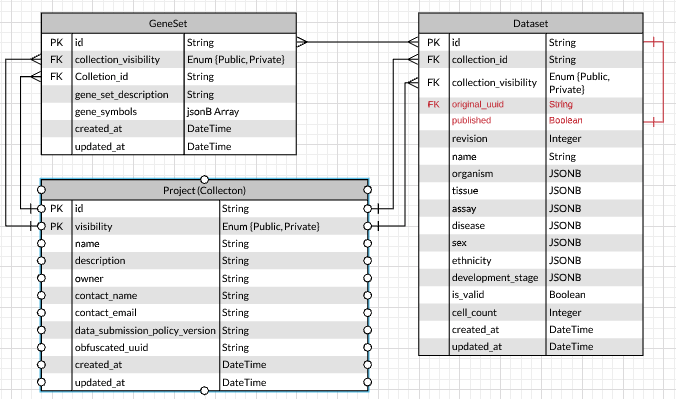
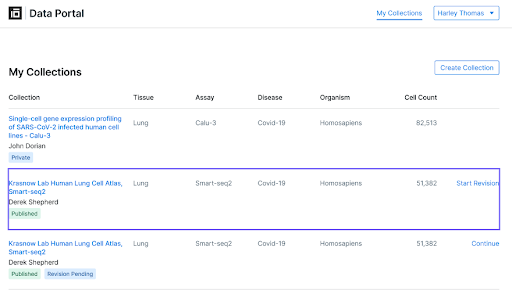
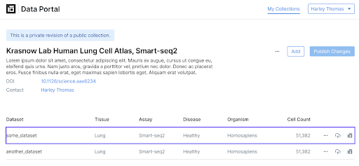
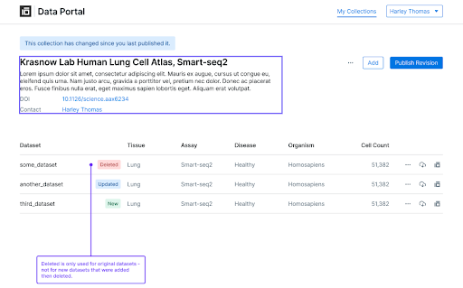
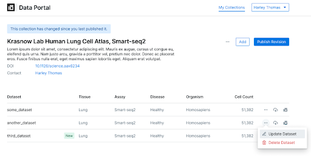
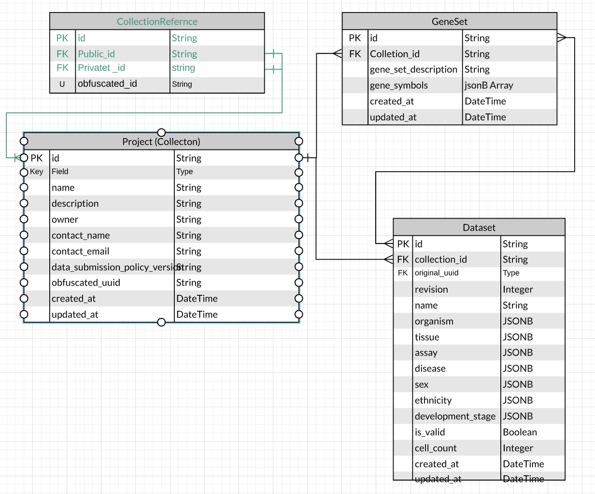

# **Collection Revisions**

**Authors**: [Trent Smith](mailto:trent.smith@chanzuckerberg.com)

**Approvers**: [Timmy Huang](mailto:thuang@chanzuckerberg.com), [Madison Dunitz](mailto:madison.dunitz@chanzuckerberg.com)

**Reviewers**: [Seve Badajoz](mailto:sbadajoz@chanzuckerberg.com), [Brian Raymor](mailto:braymor@chanzuckerberg.com), [Harley Thoma](mailto:hthomas@chanzuckerberg.com)s, [Girish Patangay](mailto:girish.patangay@chanzuckerberg.com)

## **TL;DR**

This RFC contains the details on changes required to support revisions of a public collection privately on the Cellxgene Data Portal.

## **Background**

_Curators want to privately revise a published collection and review changes with publishers. The revision may then be canceled or published as a refresh to the original published collection._

Example: There are multiple cases where a publisher has requested that a curator replace a published dataset with an updated dataset and maintain the CXG permanent link for the original dataset.

Original [GitHub issues](https://github.com/chanzuckerberg/single-cell/issues/36)

## **Terminology**

**Revision** - A copy of a published collection that is private and can be modified.

**Published Collection** - A collection that is public and immutable.

**Refreshed** - in the context of a dataset means a previously published dataset was re-uploaded in a revision and will replace the published dataset if published.

## **Product Requirements**

1. A curator MAY privately revise a published collection from _My Collections_.
2. The revision MUST be _populated_ with all the datasets and gene sets from the published collection.
3. The revision MUST be assigned a new capability URL for sharing with publishers for review.
    1. A collection being revised MUST be labeled with both `Public` and `Revising` labels in My Collections.
    1. Only one pending private revision MUST be allowed for each collection published by the curator.
4. A curator MAY share the link to the revised collection and each related CXG with reviewers.
5. A curator MUST easily understand the differences between the revision and the published collection. See [Figma](https://www.figma.com/file/jZzZF9oO0YRMxmVRDxDHp3/Public-Revisions?node-id=441%3A122)
6. A curator MAY update collection information in the revision.
7. A curator MAY add new datasets to the revision.
8. A curator MAY delete new datasets in the revision.
9. A curator MAY delete original datasets in the revision.
    1. Datasets that have been deleted in a revision and previously published must return "`Dataset Name` withdrawn by the contact." when accessed by a user.
    1. If the revision is published, then the original dataset and its CXG MUST be deleted, but the permanent link for the CXG MUST display a message to data consumers "`Dataset Name` withdrawn by the contact."
    1. If all datasets in the revised collection are deleted, the revision MUST NOT be published.
10. A curator MAY add new gene sets to the revision.
11. A curator MAY delete new gene sets in the revision.
12. A curator MAY delete original gene sets in the revision.
13. The curator MAY replace (refresh) existing datasets in the revision.
14. The curator MAY publish the revision from the _A Collection_ view.
15. The curator MAY cancel the revision from the _A Collection_ view.
16. A published revision cannot be undone.

### UX Design

[Figma](https://www.figma.com/file/jZzZF9oO0YRMxmVRDxDHp3/Public-Revisions?node-id=441%3A151)

## **Detailed Design | Architecture | Implementation**

This plan requires making minor database changes. The most complexity occurs during publishing which requires juggling some resources around. Deciding when to delete resources from S3 is another area where things can get confusing.

### Artifact Collisions Prevention

The dataset id is used to name the artifacts uploaded to S3. The way they are named will cause a naming collision when uploading a dataset. Updating a dataset during a revision will replace the published artifact, which is not desired. When uploading a dataset, use the artifact_id or something random to name the file when uploading. This will allow a collection revision to update existing datasets without disturbing the published datasets.

??How does changing the artifact naming affect Explorer??

### Data Portal Database Schema

An additional column called *original_uuid* will be added to the dataset table. This column will be used when a revision is created to track the original row.

The additional column _published_ will determine if a dataset was ever published. Datasets that have previously been published will show up in the public view of the collection even if the data set has been deleted.

### API Changes

#### GET /dp/v1/collections/{collection_uuid}

Will be updated to return a boolean name _modified_ when the collection is a revision. Modified indicates that the collection revision has been modified from the original. This flag will unlock the “Publish Collection” button.

##### Determine Modified

The modified flag returned in the response indicates that a change has occurred between the original collection and the revision. Using the time difference between *update_at* and *created_at* columns we can determine if any changes have been made in all tables related to the collection. They will not be equal if a change has been made.

#### POST /dp/v1/collections/{collection_uuid}

 Will be used to start a collection revision. The revision will be returned in the response, which is a copy of the rows related to a published collection.

#### POST /dp/v1/collections/{collection_uuid}/upload-links

Will be updated to use the _data_uuid_ field in the body, and check if the dataset has been published. If the dataset has been published before then the dataset is uploaded using the revision dataset UUID.

#### POST /dp/v1/collections/{collection_uuid}/publish

Will need to be updated to replace a published dataset with a revision. See the section on Publishing below.

### Frontend URL Changes

#### /collections/{collection_uuid}/private

Will be used to access a revision if one exists.

### Backend Changes

* Tombstoning will need to have an option to not delete the artifacts in S3.
* Function to clone a collection and all of its linked resources will need to be written.
* Need logic to determine if a collection is a revision.
* Need logic to determine if a dataset is a refresh dataset or a new dataset.
* Function for publishing a collection will need to update to support the steps outlined above.

### Revision Data Flow

#### Create

To perform a revision (see image 1), the owner of a collection navigates their “My Collections” page and selects “Start Revision” next to the public collection they would like to revise.

[Image 1](https://www.figma.com/file/jZzZF9oO0YRMxmVRDxDHp3/Public-Revisions?node-id=441%3A151)

This sends a request to *POST /dp/v1/collections/{collection_uuid}*. This endpoint creates a copy of the collection in the database and that is private. All of the genesets and datasets associated with the collection are also duplicated. The UUIDs of the published rows are copied into the *original_uuid* field of the copied row.

The duplication will be a tricky area to get right especially in linking together all of the datasets and genesets based on their _original_uuids_.

New datasets are uploaded using the _POST /dp/v1/collections/{collection_uuid}/upload-link_ endpoint.

#### Read

A user can view their revision (see image 1) by navigating to their “My Collections” page and selecting continue. This sends a request to _GET /dp/v1/collections/{collection_uuid}?visibility=PRIVATE_. The frontend knows that this is a revision because there will also be a collection with the same UUID that has visibility equal to PUBLIC.

[Image 2](https://www.figma.com/file/jZzZF9oO0YRMxmVRDxDHp3/Public-Revisions?node-id=441%3A151)

The revision page(see image 2) will display the state of the current revision. If no changes have been made then the “Publish Changes” button will be disabled. Whether a change has been made will be added in the response of a _GET /dp/v1/collections/{collection_uuid}?visibility=PRIVATE _request.

The datasets and genesets can be accessed the same way using the new UUID generated for the duplicated row.

To download a dataset in a revision you would use the _POST /dp/v1/datasets/{dataset_uuid}_ endpoint using the dataset UUID in the revision.

Say a dataset in a revision was shadowing a published dataset, the user would read the refreshed dataset using the dataset UUID in the revision. Once the revision is published the same dataset would be accessed using the original published datasets UUID. All of this UUID swapping will be hidden in the frontend by only showing the user the *original_uuid* for a revision.

The current state of a dataset in a revision is shown using the tags “Deleted”, “Updated”, “New” (see image 3).

* **Deleted** indicates a published dataset that has been tombstoned. This is determined by checking if that dataset is a _tombstone_ and is *published*.
* **Updated** indicates that the dataset was refreshed. This is determined by checking if the dataset has *original_uuid* and is not *published*.
* **New** indicated the dataset has been added during this revision. This is determined by checking if the dataset has no *original_uuid* and is not *published*.

[Image 3](https://www.figma.com/file/jZzZF9oO0YRMxmVRDxDHp3/Public-Revisions?node-id=441%3A151)

#### Update

There is no difference in the way you update fields in the collection (see image 4). The _PUT /dp/v1/collections/{collection_uuid}?visibility=PRIVATE_ endpoint is used to update the collections fields.

[Image 4](https://www.figma.com/file/jZzZF9oO0YRMxmVRDxDHp3/Public-Revisions?node-id=441%3A151)

A dataset can be updated by selecting the ellipsis next to the dataset (see image 5) and following the upload instructions. The *POST /dp/v1/collections/{collection_uuid}/upload-links* endpoint is used with the original *dataset_uui* supplied in the body to start the dataset revision upload.

[Image 5](https://www.figma.com/file/jZzZF9oO0YRMxmVRDxDHp3/Public-Revisions?node-id=441%3A151)

Updating the dataset results in a new dataset with the same *original_uuid*, and the _published_ flag set to false. The underlying assets which are public will not be deleted until the revision is published.

#### Delete

A collection revision is deleted using _DELETE /dp/v1/collection/{collection_uuid}_. If a revision is deleted then it is completely removed from the database. All unpublished datasets will be tombstoned and its s3 artifacts deleted. The cloned gene sets will be deleted from the database. Datasets that shadow a published version are deleted from the database, but their artifacts are **not** removed from S3.

A dataset is deleted using DELETE /dp/v1/dataset/{dataset_uuid}. If a published dataset is deleted in a revision then a tombstone is created. The S3 artifacts are not removed until the revision is published. This is similar to refreshing a dataset. A geneset is deleted as normal.

If a dataset in a revision is refreshed and then deleted, the refreshed dataset is removed and its artifact deleted. Finally, a tombstone is created to replace the published dataset. We can tell if the dataset is refreshed by checking if the _published_ flag is false.

#### Publishing(Read Carefully)

From the collections revision page, the user can select the “Publish Revision” button. This will open up an additional dialogue to confirm the new version(see image 6.

[Image 6](https://www.figma.com/file/jZzZF9oO0YRMxmVRDxDHp3/Public-Revisions?node-id=441%3A151)

The *POST /dp/v1/collections/{collection_uuid}/publish* will be used to publish a revision. Some swapping must occur in the database to replace a published collection with a revision. Here is a rough outline of the steps:

1. Retrieve the published collection and the revision.
1. Update the collection table
    1. Replace all links on the published collections with the link of the revision.
    1. Copy information from the revision collection to the published collection.
1. Copy over all new datasets from the revision to the published dataset and Set the published flag to True.
1. Copy over refreshed dataset and tombstones.
    1. Retrieve lists of _original_uuids_ in a revision for datasets.
    1. Update the datasets with the revision informations. For each dataset with an *original_uuid*, copy all of the columns except *original_uuid* to the published datasets refered to by the *original_uuid*, and delete all of the published_artifacts and upload_status on the published dataset. Finally, set the _published_ flag to True.
    1. For a refreshed dataset, the deployed directory URL must match the URL in the published version. In the host-cellxgene bucket replace the original cxg file refered to by the published dataset deployed directory url with the revision file. Also update the revision deployed directory to match the new bucket location.
    1. Delete the old deployed directory Link the revised deployed directory to the published dataset.
1. Update genesets
    1. Delete all of the geneset rows on the published collection.
    1. Link the revision genesets to the published collection.
    1. If the dataset is a refreshed dataset, then you must link the geneset to the *original_uuid*.
1. Delete the collection revision row and all linked resources.

#### Sharing

Sharing a revision is the same as sharing a private collection. The _GET /dp/v1/collections/{collection_uuid}?visibility=PRIVATE_ can be used by an unauthenticated user to read the collection revision.

### Test plan

1. Create a revision.
2. Delete a revision.
3. Add/Remove genesets to a revision.
4. Add/Remove/Update a dataset in a revision.
5. Tombstone a dataset in a revision.
6. Share a read-only version of a collection revision. 
7. Publishing a collection maintains the dataset UUIDs
8. Deleting a dataset revision does not remove the published revision until the revision is published.

## **Alternatives**

### Collection References

Using Collection reference we can remove Visibility from the table. The CollectionReferences ID will be the UUID the user sees. This should make it easier to have an immutable ID for a collection. This will also help if the shape of the database changes.

### Join Tables

The goal of this solution was to put the complexity in the database schema to keep the frontend and backend changes simple. This instead added complexity to the database and required a lot of refactoring on the backend. Since we will only be supporting a single revision at a time we get no benefit from adding this complexity. This solution would be more applicable if multiple revisions would be supported.

This is a simplified version of the Data Portal Schema that highlights the relevant schema changes required to support revisions. Significant changes will need to be made to the backend code to handle CRUD operations for this schema.

#### Adding many-to-many relationships between dataset & collections, and genesets & collections

A many-to-many relationship is created between datasets & collections, and gene sets & collections. This allows a published dataset and geneset to be linked to a published collection and a revision.

`collection_id` and `collect_visibility` will be removed from the Dataset and Geneset table. Those columns will be moved to the join table.

#### Geneset and Datasets will have a UUID field which is the UUID seen by the user

UUID is added to geneset and dataset, this will be the same value as the current `id` for each respectively. The `id` will become a simple incrementing counter. This allows us to store a revision and published version of the resource. They will have a different `id` and the same UUID.

##### Create_

To create a revision, make a copy of the published collection and the collection links. The new collection’s visibility will be private. All of the datasets and geneset links to the public collections will be linked to the private collection and the published collection using the join tables.

New Datasets and genesets can be added normally as if adding to a private collection. The new resources will be connected to the revision. This prevents new resources from showing up in the published collection.

##### Read_

Reading a revision will query the database for a private collection and retrieve all linked resources. If there are duplicate UUIDs for a dataset or a geneset, then the revision is returned. The revision can be identified by its later creation date.

##### Update_

The private collection table and collection links table are updated as normal for a revision. It is the same process as updating a private collection. The columns can be changed and links can be added and removed without making any changes to the Data Portal code.

Updating a dataset and geneset is more complicated. If we are updating a dataset that is part of a published dataset then a new dataset is created and linked to the private collection with the same UUID as the published dataset. The published dataset is unlinked from the collection revision. Genesets links will need to be duplicated to the new dataset.

##### Delete_

* The private collections fields and links are deleted as normal.
* Deleting a collection revision is accomplished by deleting the collection row and all orphaned resources.
* Collection Revisions are not tombstoned.
* Deleting an unpublished dataset in a revision results in the tombstoning of that dataset and deleting its deployed resources.
* Deleting a published dataset in a revision creates a new dataset that is a clone of the published dataset, except the artifacts are not deleted until published, and the tombstone is set.
* Deleting an update to a published dataset results in the creation of a tombstone for the published dataset. The artifact will not be deleted until the revision is published.

##### Publish

To publish the revision, the current published collection will be deleted and all orphaned genesets, datasets, and project links will be deleted. Orphaned datasets will need to have their S3 artifacts cleaned up before tombstoning them. The private collection will be changed to the public, the changes will need to propagate through the join tables. If the revision is tombstoned.

#### API Changes_

* As the owner, return the revision and the published collection when listing the user’s collections.
* The frontend will need to display correctly when it finds two collections with the same UUID but different visibilities.

##### POST /dp/v1/collections/{collection_uuid}_

 Will be used to start a collection revision.

##### DELETE /dp/v1/collections/{collection_uuid}_

Will delete the revision or tombstone a private collection. We can determine it's a revision if there is a public version of the collection.

##### DELETE /dp/v1/datasets/{dataset_uuid}_

Datasets that have always been private will be tombstoned and artifacts deleted. If it was published then a tombstone is created and the artifacts are not removed until the revision is published.

##### DELETE /dp/v1/genesets/{geneset_uuid}

Datasets that have always been private can be deleted from the database. If it was published then it is unlinked from the collection and datasets????

#### Backend Changes_

Care will need to be taken when returning a response from SQLAlchemy. The many-to-many relationships added to the database schema will result in more information being returned than needed. This can be easily fixed by adjusting how we use relationships in the database ORM. However since the ORM object are used throughout the code, this could be expensive in refactoring dependent code and tests.

### Track Revision History

Create an additional table that will record revision history.

[https://davenathanaeld.medium.com/database-design-revisions-c91d63400bc1](https://davenathanaeld.medium.com/database-design-revisions-c91d63400bc1)

* This would allow us to redo and undo changes.
* Changes would be tracked in a revision table
* Publishing would apply all of the changes in the revision table for the public collection.
* We would need to carefully plan out the column of the revision table to handle all CRUD operations.
* When a user wants to view the revision, we would need to replay all of the changes onto the publish collection to get to the current revision state.
* It could get complicated migrating a database with revision in progress.

## **References**

[0] [lucid diagrams](https://lucid.app/lucidchart/b88328c0-4706-4021-ac6a-74cae82704d3/edit?page=0_0#)

[1] [figmas](https://www.figma.com/file/jZzZF9oO0YRMxmVRDxDHp3/Public-Revisions?node-id=441%3A122)

[2] [GitHub issues](https://github.com/chanzuckerberg/single-cell/issues/36)