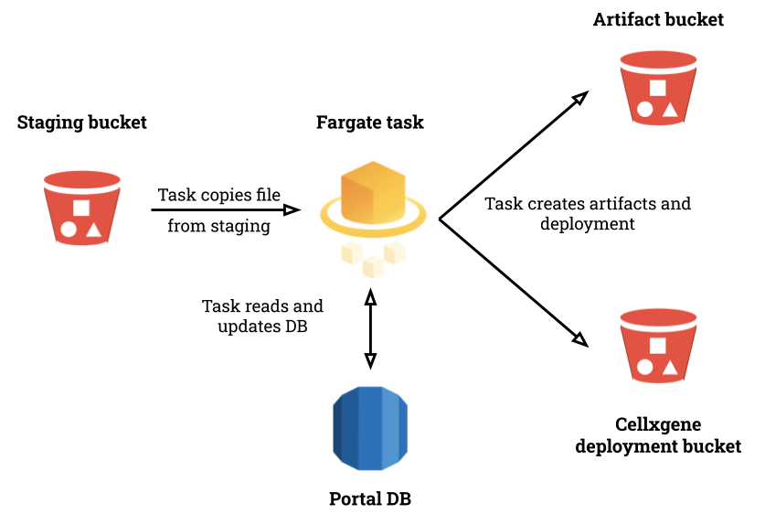
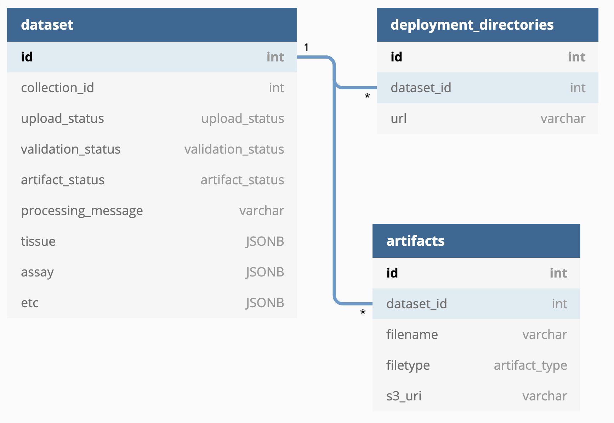

# Validation and Conversion of Uploaded Datasets

**Authors:** [Marcus Kinsella](mkinsella@chanzuckerberg.com)

**Approvers:** [Arathi Mani](mailto:arathi.mani@chanzuckerberg.com), [Trent
Smith](mailto:trent.smith@chanzuckerberg.com), [Brian Raymor](mailto:braymor@chanzuckerberg.com)

## tl;dr

We want datasets in the portal to follow our schema, be viewable in cellxgene, and be available for download in multiple
file formats. This RFC describes the process and infrastructure for validating uploaded datasets and processing them so
they are fully available in the portal.

## Problem Statement

There isn't a broad community consensus around how single cell datasets should be stored and annotated. This
makes it harder to integrate these datasets, which is bad because that's a main aim of our single cell work. So, we have
a simple schema that we want all datasets to adhere to. If all the datasets we store at least follow this schema, then
our data corpus will be usable for data integration research and the production of atlases.

While the schema is pretty lightweight, we still need to double-check that uploaded datasets follow it. And, if the
dataset does not, we want to give the submitter some prompt and useful message explaining why.

Another complication is that single cell datasets come in different formats that are associated with different
toolchains. We want to support as many of those toolchains as we can, so we're going to convert datasets into
different formats. It seems to make sense to do this right after validation is complete since we're already parsing
the original file anyway, and there's not really a good reason to delay converting.

## Product Requirements

The key requirement here is that users can prepare their own datasets without intervention from CZI. This goes along
with all the other work to support self-submission: file upload, collection creation, and publication.

## Detailed Design

### Overview

There are three main phases in the creation of a new dataset in the data portal:

1. The submitter prepares a dataset file. This is done locally, outside the data portal, assisted by tooling we provide.
   The outcome of this phase is a file in a format the data portal accepts that follows the schema.
2. The submitter needs to then upload the dataset file to the portal. This involves things like creating a collection
   and performing whatever consent/attestation is required. Then the submitter actually uploads the file, a process
   which is described in detail in other RFCs.
3. The uploaded file then needs to be validated and processed so it can be available via the portal. This involves four
   main tasks:
   - Validating that the file follows the schema.
   - Updating the portal database with information about the uploaded file, things like tissue or ethnicity that come
     from the schema.
   - Converting the uploaded file to different formats and associating those with the dataset.
   - Creating a cellxgene deployment for the dataset.

This RFC is concerned with phase 3.

### Relevant Components

There are six main components involved in validation and processing:

1. Staging bucket. The S3 bucket where uploaded file are placed by the upload process.
2. Artifact bucket. The S3 bucket where artifacts associated with datasets are stored and served.
3. cellxgene deployment bucket. The S3 bucket configured to serve datasets via cellxgene.
4. Portal database. The database where information about datasets is stored. The portal API queries this database when
   responding to requests.
5. Validation and processing image. The Docker image containing the dependencies and script to validate and process.
6. Validation and processing Fargate task. The task definition for executing the image with AWS Fargate.

#### Portal Database Schema

The relevant part of the portal database is three tables: `dataset`, `artifacts`, and `deployment_directories`.

The `dataset` table tracks the status of datasets and various metadata about them that is used by the portal frontend.
There are three status fields:

- upload\_status: uploading, uploaded, canceled
- validation\_status: validating, valid, invalid
- artifact\_status: creating, complete

The `artifacts` table tracks the different downloadable files associated with a dataset. This stores the format of the
download and the bucket and object key in the artifact bucket.

The `deployment_directories` table tracks the cellxgene deployments associated with a dataset and the URL where the
deployment can be accessed.

### Handoff from Upload

At the end of the upload process there must be two elements present in AWS:

1. A row in the `dataset` table with `id` and `collection_id` populated and `upload_status` set to "uploaded".
2. A dataset file in the staging bucket with a `x-amz-meta-dataset-id` metadata field whose value is the `id` of the new
   row in the `dataset` table.

A [CloudWatch Event](https://docs.aws.amazon.com/AmazonCloudWatch/latest/events/CloudWatch-Events-tutorial-ECS.html)
will trigger the execution of the Fargate task when a new dataset file is added to the staging bucket.

### Steps of the Fargate Task

1. Check the `dataset` table to verify that the expected row exists and `upload_status` is "uploaded". To avoid possible
   race conditions from the upload process, wait and recheck if this isn't true.
2. Set the `validation_status` in `dataset` to "validating".
3. Localize the uploaded file. HDF5 doesn't usually work with remote files very well.
4. Run the `cellxgene schema validate` command to do a shallow validation of the dataset file.
   - If this has a non-zero exit code, set `validation_status` to "invalid", write stdout from the command to
     `processing_message`, and halt.
   - Otherwise, set `validation_status` to "valid" and `artifact_status` to "creating".
5. Read the appropriate values from the dataset file and upload the JSONB fields in the `dataset` table for tissue,
   assay, etc.
6. For format in `{loom, h5ad, rds}`
   - If the format does not match the format of the uploaded dataset file, run a conversion script.
   - Copy the file to the artifact bucket.
   - Insert a row into `artifacts` with the format and S3 key.
7. Convert to cxg, copy to the cellxgene deployment bucket, and insert a row into `deployment_directories`.
8. Set `artifact_status` to "complete".

The format conversions in steps 6 and 7 can occur in parallel, but they're also slower and sometimes use a lot of
memory. There are existing tools that can perform the conversions: [sceasy](https://github.com/cellgeni/sceasy),
[commands in
Seurat](https://satijalab.org/seurat/v3.0/conversion_vignette.html), and `cellxgene convert`.

The main step that impacts submitter user experience is 4. Users will want to know as quickly as possible whether their
file has been accepted, so this is updated in the DB before any other work takes place.

### Monitoring and error reporting

The initial volume of submitted datasets is expected to be relatively low, on the order of tens per month. So we likely
will not need a very complex monitoring solution at first.

There are two main types of errors we should anticipate. The first is a failure of the submitted dataset to validate.
This isn't quite an "error" as it's part of the expected functioning of the system, but it nevertheless results in a
dataset that is not properly loaded into the portal. In that case, the dataset is marked as "invalid" in the database
along with an error message that the frontend can display to the user.

The other is an unexpected failure during the Fargate task execution. In the initial implementation, these can be found
and investigated manually via a CloudWatch dashboard. As we get a better understanding of failure and recovery modes, we
can configure ECS events to automate error handling.

## Alternatives

Other teams at CZI have used Airflow to orchestrate ETL tasks. Airflow comes with a nicer interface and more flexbility
around triggering tasks but more overhead in terms of infrastructure to maintain.

After discussion with the infra team, we agreed that the simpler, single-ECS-task approach was a reasonable starting
point. But if our monitoring needs increase, or we want to use the Airflow parallelization patterns, we should consider
using Airflow in the future.
