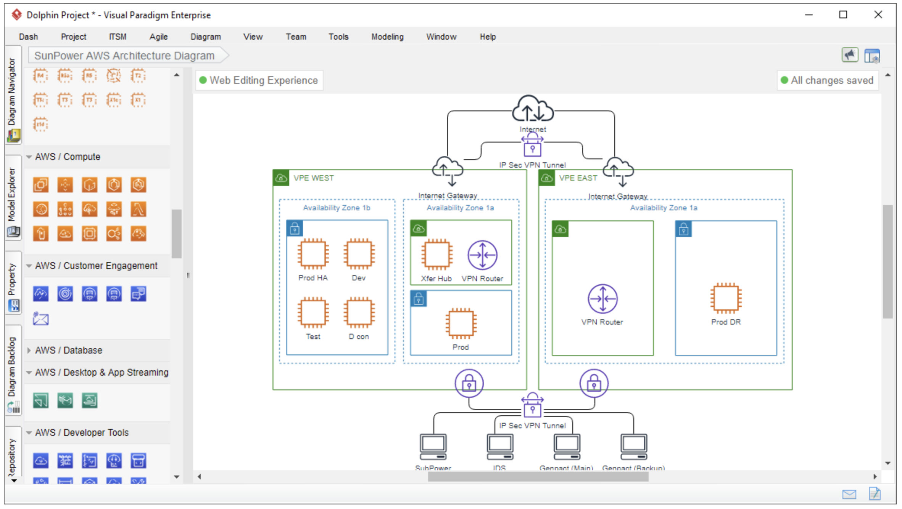

# Gene Set Data Format

The data format for gene sets should also support the export of differential expression results and a user uploading 
their own distribution for a gene set. If there is a standard format for differential expression output, we should 
follow that. If not, the format should be as straightforward as possible while serving these use cases.

## [Optional] Subtitle of my design 

**Authors:** [Nice Person](mailto:some.nice.person@chanzuckerberg.com)

**Approvers:** [Friendly Tech Person](mailto:some.nice.person@chanzuckerberg.com), [Friendly PM Person](mailto:some.nice.person@chanzuckerberg.com), [Friendly Tech Person2](mailto:some.nice.person@chanzuckerberg.com), [Girish Patangay](mailto:girish.patangay@chanzuckerberg.com), [Sara Gerber](mailto:sara.gerber@chanzuckerberg.com) 

## tl;dr 

This RFC contains the details about the data format for the gene set feature. It will support the export of differential
 expression results and allow a user to upload their own gene sets for analysis. 
## Problem Statement | Background

Gene sets are the expected output of differential expression analysis in cellxgene. Two (non-overlaping) sets of cells 
are selected and the difference in the expression level for each gene is computed by comparing the average 
expression level for each set of cells. When there is a particularly large difference in expression between the two sets of 
cells, that gene is identified and presented to the user. To ensure consistency and compatibility it is necessary to define a 
data format for storing references to these genes and any accompanying statistical data. 

## [Optional] Product Requirements

This section should come primarily from a Product Manager. For large designs, technical designs should be closely aligned with a product goal and thus should be explicitly bullet-pointed in this section to ensure alignment.
- Users should be able to export differential expression results
- Users should be able to upload their own gene sets and see them in the right side bar with the option to apply them within current cellxgene functionality, s if the same gene ontology was used when generating the current dataset and the geneset uploaded by the user (ie the gene names match) 
- If there is a standard format for differential expression output, we should follow that. If not, the format should be as straightforward as possible while serving these above cases.

### [Optional] Nonfunctional requirements

Nonfunctional requirements are not directly related to the user story but may instead reflect some technical aspect of the implementation, such as latency. [Here's](https://en.wikipedia.org/wiki/Non-functional_requirement) a more comprehensive list of nonfunctional requirements.
- Users should be able to export precomputed differential expression results in real time
- Users should be able to upload gene sets and have them immediately appear in the right side bar

## Detailed Design | Architecture | Implementation

I leave it up to the author to determine the best layout of this section in order to clearly render their design. Pictures are highly encouraged.

### User uploaded gene sets

### Differential output

**Figure 1:** This is the [first Google image](https://www.visual-paradigm.com/features/aws-architecture-diagram-tool/) that came up when I searched “software architecture diagram.”

### [Optional] Data model

This section details anything from database schemas, to filesystem structures, to storage formats. Anything that "persists", is accessed by multiple component, or is something that could cause upgrade issues upon change, should belong in this section.
Fully supporting differential expression is out of the scope of this RFC. But the data model described below has been designed to allow for differential expression in the future.
To support genesets X tables will be added to the cellxgene relational database
- Gene
   - UUID (generated)
   - GeneName
   - OntologyId?
- GeneGeneSetLink
   - UUID
   - Gene UUID
   - GeneSet UUID
- GeneSet
   - UUID (generated)
   - GeneSet Name (required)
   - Gene Count (generated)
   - Comments (optional, only available when the geneset is generated by cellxgene)
- GeneSetUserLink
   - User UUID
   - GeneSet UUID
   - Comments (optional)

### [Optional] Test plan

This section details the sorts of tests that will be written to give confidence that the implementation matches the design. Enumerating the test cases is a good way to find holes in the design and helps the reviewers understand, in more detail, how the feature works. It also helps get into the mindset of test driven development.

### [Optional] Monitoring and error reporting

This section contains information on the monitoring and error reporting features that will be built in order for the system to respond and alert users on failures of the feature being designed. This helps ensure that failure modes are thought about and the users' experiences with facing errors is consistent and helpful, rather than frustrating.

## [Optional] Alternatives

Especially for larger designs, you probably considered more than one design so it’s worthwhile to briefly list the others and a short note on why you decided against it.

## References

Any relevant documents or prior art should be clearly listed here. Any citation of figures or papers should also be clearly listed here. Of course, they can also be linked throughout the document when directly referenced.

[0] [Image of random system architecture](https://www.visual-paradigm.com/features/aws-architecture-diagram-tool/).

[1] [Google Developer Documentation Style Guide](https://developers.google.com/style/highlights#introduction_1)
